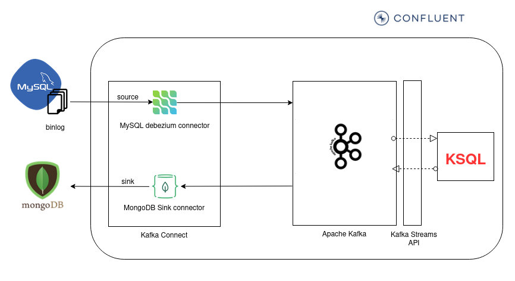

The following project implements a Real-time database replicator with KSQL and Confluent platform.

- Source database: MySQL
- New database: MongoDB

### Architecture


## Build local environment (Confluent Platform + MongoDB + MySQL)
To build the local environment you have to modify the file offered by Confluent [Confluent All-In_One](https://raw.githubusercontent.com/confluentinc/cp-all-in-one/6.1.1-post/cp-all-in-one/docker-compose.yml) which starts all the services necessary to build a locally Confluent platform.
This file needs some modifications:
- Add MySQL image
- Add MongoDB image
- Update Version of KSQL server (to allow the use of the key as a structure)

1. Build local environment [docker-compose](environment/docker-compose.yml)
```
  docker-compose-up -d
```

2. Create a new database (inventory) and associated collection (products) in MongoDB.

3. Install the connector libraries in Kafka Connect service (it's necessary restart Kafka Connect service)
```
  docker exec -it connect confluent-hub install mongodb/kafka-connect-mongodb:1.5.0 (MONGODB)
  docker exec -it connect confluent-hub install debezium/debezium-connector-mysql:1.5.0 (MySQL)
```

4. Register the MySQL connector in Kafka Connect service [MySQL connector configuration file](connectors/source-mysql-connector.json)
```
  curl -s -X POST -H "Accept:application/json" -H "Content-Type:application/json" localhost:8083/connectors/ -d @source-mysql-connector.json
```

5. Register the MongoDB connector in Kafka Connect service [MongoDB connector configuration file](connectors/sink-mongodb-connector.json)
```
  curl -s -X POST -H "Accept:application/json" -H "Content-Type:application/json" localhost:8083/connectors/ -d @sink-mongodb-connector.json
```

## Process events with KSQL

This STREAM processes the events sent by debezium.

```
  CREATE STREAM S_PRODUCTS_FROM_KAFKA (SCHEMA STRUCT<PAYLOAD STRUCT<ID int>> KEY,PAYLOAD STRUCT<BEFORE STRUCT<ID int>, AFTER STRUCT<ID int, NAME varchar, DESCRIPTION varchar, WEIGHT double>, OP varchar>) 
  WITH (KAFKA_TOPIC='dbserver1.inventory.products', KEY_FORMAT='JSON', VALUE_FORMAT='JSON');
```

This STREAM prepares the data to inject the MongoDB connector to send data to MongoDB
```
CREATE STREAM S_PRODUCTS_SINK_MONGODB WITH (KAFKA_TOPIC='products_sink_mongodb') AS
SELECT 
	SCHEMA->PAYLOAD as "key", PAYLOAD->AFTER->ID as "id", PAYLOAD->AFTER->NAME as "name", PAYLOAD->AFTER->DESCRIPTION as "description", PAYLOAD->AFTER->WEIGHT as "weight"
FROM S_PRODUCTS_FROM_KAFKA
PARTITION BY SCHEMA->PAYLOAD
EMIT CHANGES;
```
